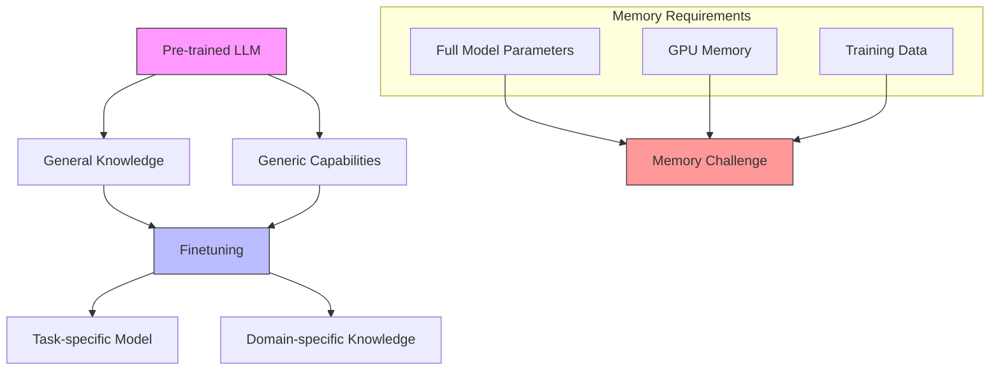
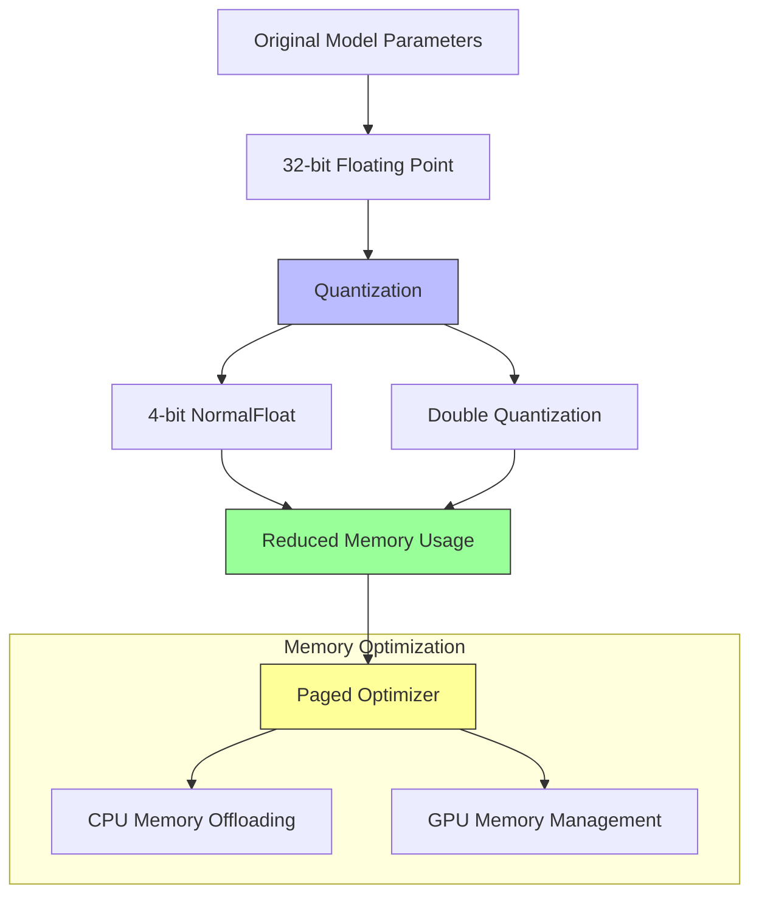
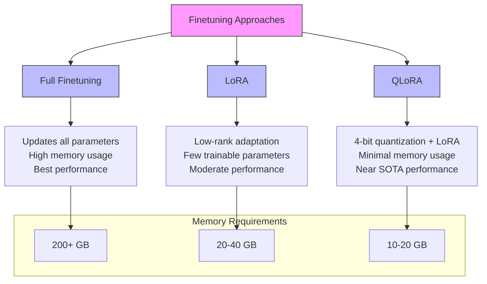

---
## Introduction to Finetuning

Finetuning is a crucial technique in adapting pre-trained language models for specific tasks or domains. Here's a visual representation of the finetuning process:

### Key Concepts
- Pre-trained models come with general knowledge and capabilities
- Finetuning adapts these capabilities to specific use cases
- The process requires significant computational resources
---
## Memory Challenges in Finetuning

The primary challenge in finetuning Large Language Models lies in their enormous memory requirements. Let's break down the memory needs for a typical 13B parameter model:

1. **Base Model Storage**
   - Each parameter: 32-bit floating-point (4 bytes)
   - Total size: 13B × 4 bytes = 52GB

2. **Training Requirements**
   - Model parameters: 52GB
   - Gradients: 52GB
   - Optimiser states: 104GB (2 copies)
   - Total: ~208GB GPU memory
---
## Quantisation Overview

Quantisation offers a solution to memory challenges. Here's a visualisation of quantisation and memory optimisation techniques:

---
## Advanced Quantisation Techniques

### 1. 4-bit NormalFloat
- Reduces precision from 32-bit to 4-bit
- Preserves normal distribution of weights
- Memory reduction: 87.5%
- Example: -0.765432 (32-bit) → -0.75 (4-bit)
---
### 2. Double Quantisation
- Two-step quantisation process:
  1. Quantise weights to 4-bit
  2. Quantise scaling factors
- Additional 10-20% memory reduction
---
### 3. Paged Optimiser
- CPU memory utilisation for parameter storage
- Step-by-step process:
  1. Load parameter batch to GPU
  2. Compute gradients
  3. Update parameters
  4. Store in CPU memory
  5. Repeat with next batch
---
### 4. LoRA (Low-Rank Adaptation)
- Matrix decomposition approach
- Example:
  - Original: 1000×1000 matrix
  - Decomposed: 1000×8 and 8×1000 matrices
  - Parameter reduction: >99%
---
## Comparison of Finetuning Approaches

Here's a visual comparison of different finetuning methods:

---
### Detailed Comparison

1. **Full Finetuning**
   - Updates all model parameters
   - Memory requirement: 200GB+ (13B model)
   - Best possible performance
   - Limited by GPU availability

2. **LoRA**
   - Trains only rank decomposition matrices
   - Memory requirement: 20-40GB
   - Good performance
   - More accessible hardware requirements

3. **QLoRA**
   - Combines 4-bit quantisation with LoRA
   - Memory requirement: 10-20GB
   - Near-SOTA performance
   - Can run on single consumer GPU
---
## Practical Implications

1. **Hardware Requirements**
   - Full Finetuning: Multiple high-end GPUs
   - LoRA: Single high-end GPU
   - QLoRA: Consumer-grade GPU (e.g., RTX 4090)

2. **Training Time**
   - Full Finetuning: Longest training time
   - LoRA: Moderate training time
   - QLoRA: Similar to LoRA

3. **Performance vs Resource Trade-off**
   - Full Finetuning: Highest performance, highest cost
   - LoRA: Good performance, moderate cost
   - QLoRA: Near-optimal performance, lowest cost
---
## Conclusion

QLoRA represents a significant advancement in making LLM finetuning more accessible while maintaining high performance. By combining quantisation techniques with LoRA, it enables training of large models on consumer hardware, democratising access to LLM customisation.