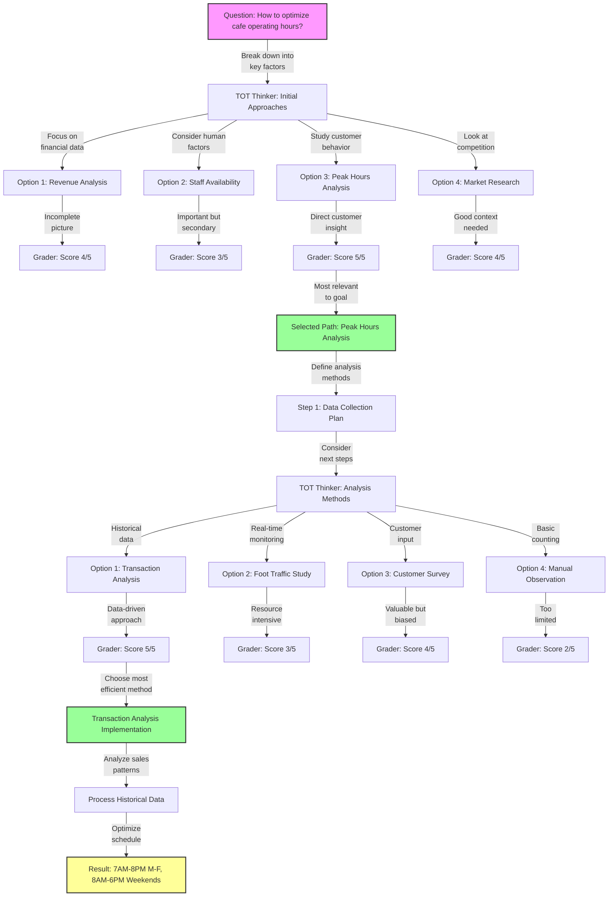

# TL;DR
1. Tree of Thoughts (ToT) is a systematic problem-solving methodology that breaks down complex problems into evaluated decision trees
2. It uses multiple agents (Thinker, Grader) to generate and evaluate solution paths, leading to optimal decision making
3. The method combines broad exploration with focused execution, making it effective for both analytical and business problems

# Motivation 
- Traditional problem-solving approaches often lack systematic evaluation of multiple solution paths
- Complex problems require structured thinking but also flexibility to explore alternatives
- Need for a methodology that combines analytical rigor with practical implementation
- ToT provides a framework for documenting and evaluating decision-making processes
- Helps in making objective decisions by scoring different approaches

# Key Takeaways
1. **Systematic Evaluation**
   - Each solution path is scored objectively
   - Multiple perspectives are considered before decisions
   - Process is documented and traceable

2. **Flexible Application**
   - Works for both quantitative and qualitative problems
   - Can be adapted to different domains (math, business, etc.)
   - Allows for course correction through multiple stages

3. **Structured Process**
   - Clear roles for different agents (Thinker, Grader)
   - Consistent evaluation criteria
   - Iterative refinement of solutions

# Technical Details
1. **Core Components**
   ```mermaid
   graph LR
       Q[Question: Initial Problem]
       Q -->|"Generate options"| TOT[TOT Thinker]
       TOT -->|"Evaluate"| G[Grader]
       G -->|"Select best path"| S[Selected Approach]
       S -->|"Refine"| TOT2[Next Steps]
   ```

2. **Key Agents**
   - User Proxy: Initiates the problem
   - Reasoning Agent: Coordinates process
   - TOT Thinker: Generates options
   - TOT Grader: Evaluates solutions

3. **Scoring System**
   - 5-point scale for evaluation
   - Multiple criteria considered
   - Consistent scoring across options

# Implementation notes
1. **Problem Definition**
   - Clear initial question
   - Well-defined scope
   - Measurable outcomes

2. **Option Generation**
   - Multiple approaches considered
   - Broad initial exploration
   - Refinement in subsequent stages

3. **Evaluation Process**
   - Objective scoring criteria
   - Documentation of reasoning
   - Selection of optimal paths

4. **Example Implementation**
   ```python
   def tot_process(problem):
       # Initial branching
       options = tot_thinker.generate_options(problem)
       scores = tot_grader.evaluate_options(options)
       
       # Select best path
       best_option = select_highest_score(options, scores)
       
       # Refine solution
       next_steps = tot_thinker.generate_next_steps(best_option)
       final_path = tot_grader.evaluate_and_select(next_steps)
       
       return implement_solution(final_path)
   ```

# Questions
1. How does ToT handle conflicting evaluation criteria?
2. Can the methodology be automated with AI agents?
3. What are the limitations for very large decision trees?
4. How to determine the optimal number of options to generate?
5. Is there a way to parallelize the evaluation process?

# Action Items
- [x] Understand basic methodology
- [ ] Implement example problem
- [ ] Create evaluation criteria template
- [ ] Test with business case
- [ ] Document results
- [ ] Share findings with team

# Related resources
- [Original Tree of Thoughts paper](https://arxiv.org/pdf/2305.10601)
- [AG2 Blog](https://ag2ai.github.io/ag2/docs/notebooks/agentchat_reasoning_agent/)

# Update log
- 2024-12-12: Initial analysis and template creation
- 2024-12-12: Added business case example
- 2024-12-12: Created implementation notes and technical details
- 2024-12-12: Documented questions and action items