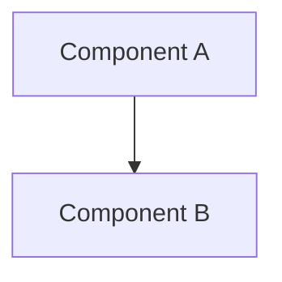

# {{title}}
## Project Overview

### Goal 
<!-- What am I trying to achieve -->

### Expected Outcomes
<!-- What does success look like -->

### Related Projects
<!-- Link to related work/experiments -->
- [[_index]]

## Technical Stack
### Core Technologies
- Language:
- Framework:
- Tools:

### Env Setup
```bash
# Env setup commands
```

### Implementation Details
#### Architecture
<!-- High level system design, components or flow diagrams -->



#### Key Components
1. Component Name
	1. Purpose:
	2. Implementation:
	```python
```

2. 

#### API Design
```json
```

## Experiments
### Experiment 1: {{experiment_name}}
- Hypothesis:
- Setup:
```python
#setup code
```
- Results: 
- Conclusions:


## Performance Metrics

| Metric   | Value | Notes       |
| -------- | ----- | ----------- |
| metric 1 | value | description |
|          |       |             |
|          |       |             |

## Problems Encountered
### Problem 1: {{problem_title}}
- Description
- Solution attemps:
	1. Attempt 1:
	2. Attempt 2:
- Resolution:
- Learnings:


## Progress Log
{{date:YYYY-MM-DD}}
- Changes made:
- Issues encountered:
- Next steps:
### TODOs:
- [ ] high priority task
- [ ] medium priority task
- [ ] low priority task 
- [ ] 